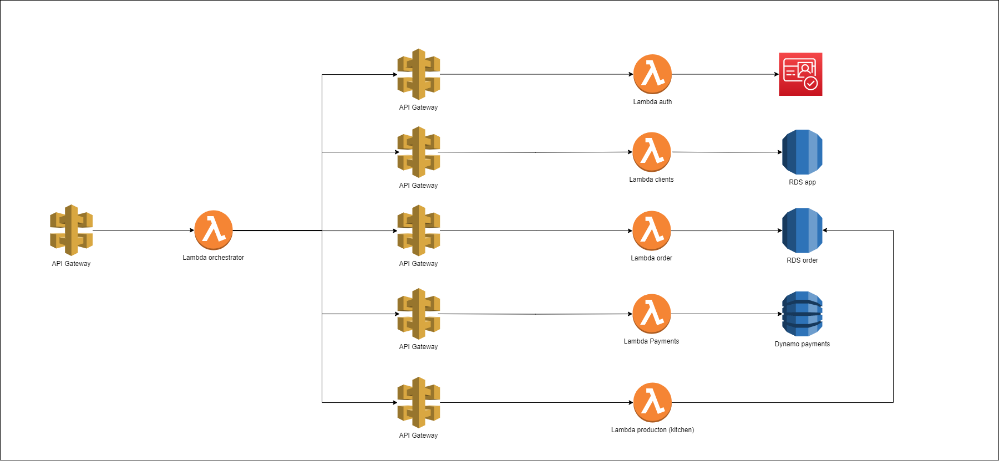

## Função Lambda para orquestração da jornada de pedidos da lanchonete FIAP LANCHES

Este repositório contém uma função Lambda escrita em Python que tem como objeito orquestrar todo o ciclo de vida do fluxo de pedido, pagamento e finalmente envio do pedido para a cozinha. Abaixo estão as instruções para instalar as dependências necessárias e executar os arquivos `local_api.py` e `local.py` localmente.

### Video Arquitetura
https://youtu.be/UNHsbJfV1ZM

### Arquitetura


### Relatório RIPD
https://docs.google.com/document/d/1B95qNDZeVxFm43rZ7FqVjK8sg-2wFoqW/edit

### Zap Report
Primeira execução: 
Segunda execução: 

### Requisitos

- Python 3.7 ou superior
- `pip` (gerenciador de pacotes do Python)
- `virtualenv` (opcional, mas recomendado)

### Instalação das Dependências

1. **Clonar o repositório:**

   ```bash
   git clone https://github.com/usuario/repositorio.git
   cd repositorio
   ```

2. **Criação da virtualenv**
   ```bash
    python -m venv venv
    source venv/bin/activate
   ```

3. **Instalação de dependências**

   ```bash
   pip install -r requirements.txt
   ```

### Execução local
1. **Executar o arquivo local_api.py**
    - Arquivo responsável por subir um servidor local para as APIs
    ```
    python local_api.py
    ```
2. **Executar o arquivo local_api.py**
    - Arquivo para realizar a "invocação" do lambda localmente
    ```
    python local.py
    ```

